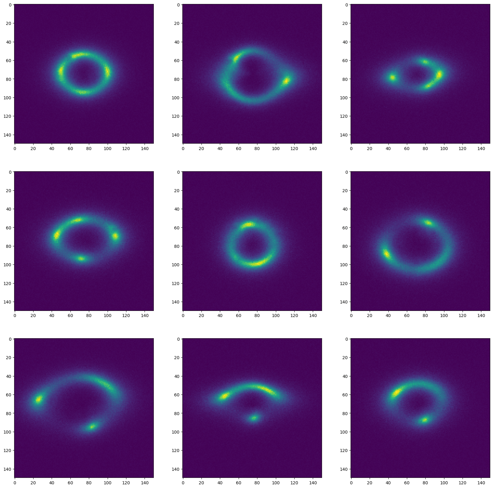
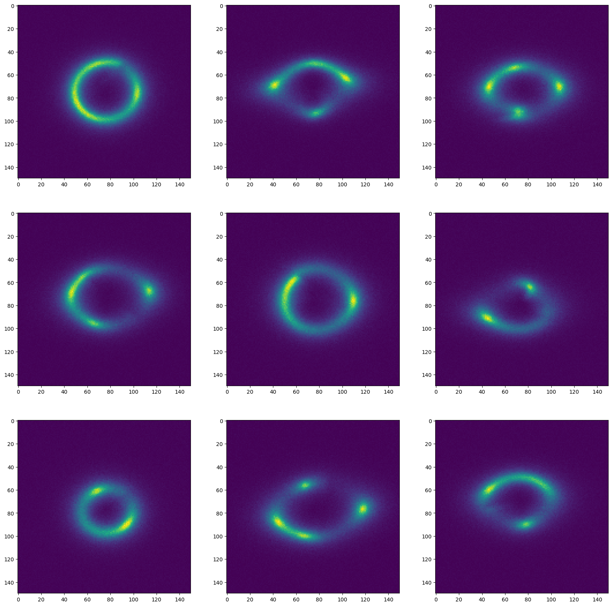
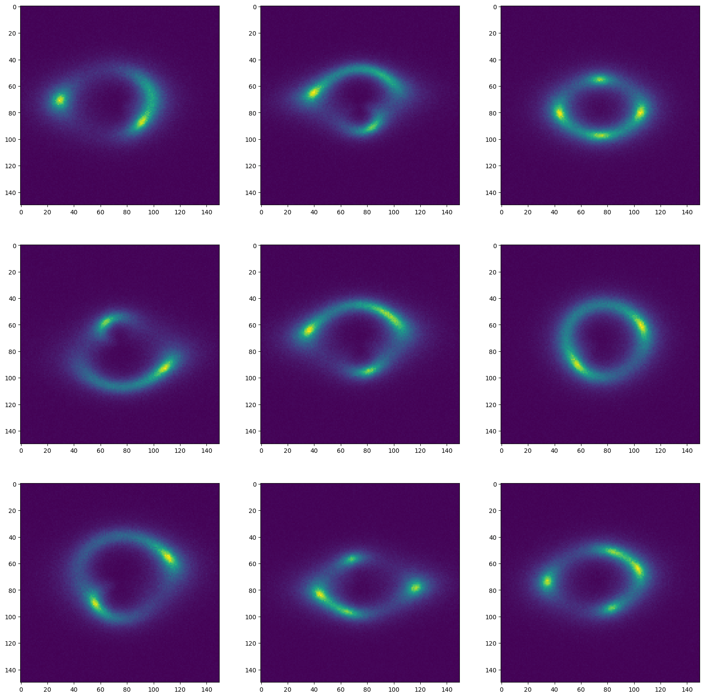
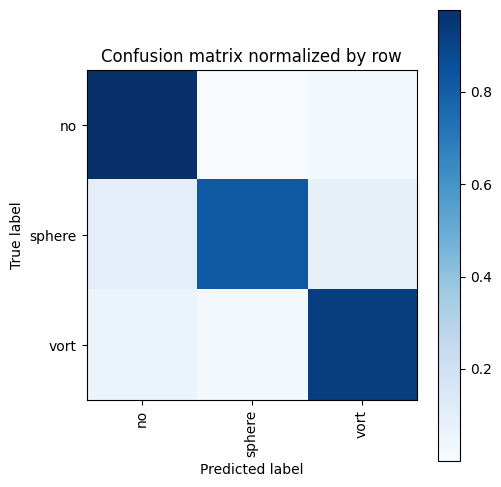
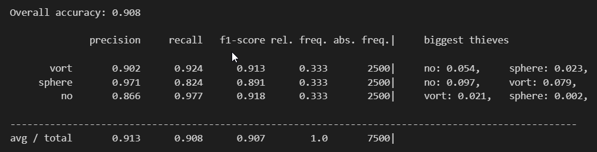
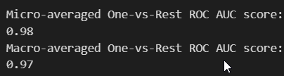
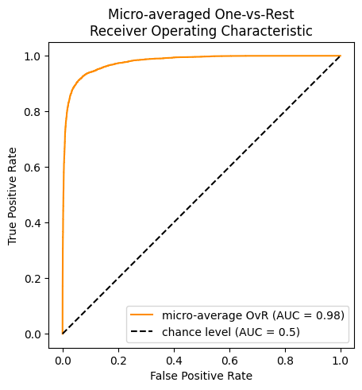
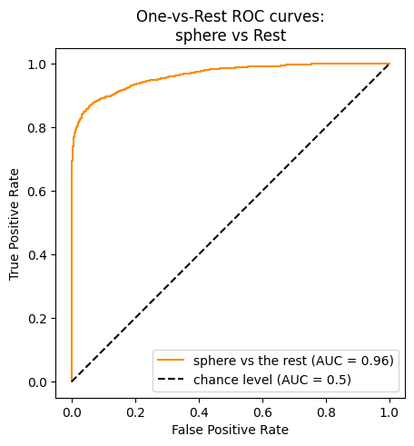
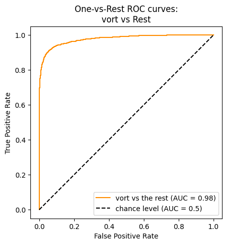
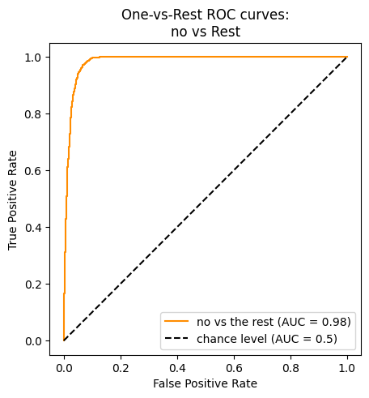

# General Test

## EDA

### Sphere Sub structure

### Vort Sub structure

### No Sub structure

## Results

| Method             | Description | Result (Accuracy) |
|--------------------|-------------|-------------------|
|Basic CNN           | custom CNN network with no pretrain weights| Not Converging |
|MobileNetV3 small| MobileNetV3 architecture pretrained on Imagenet| 0.711|
|MobileViT | Visual Attention Transformer pretrained on Imagenet | 0.908 |

### Best Results

