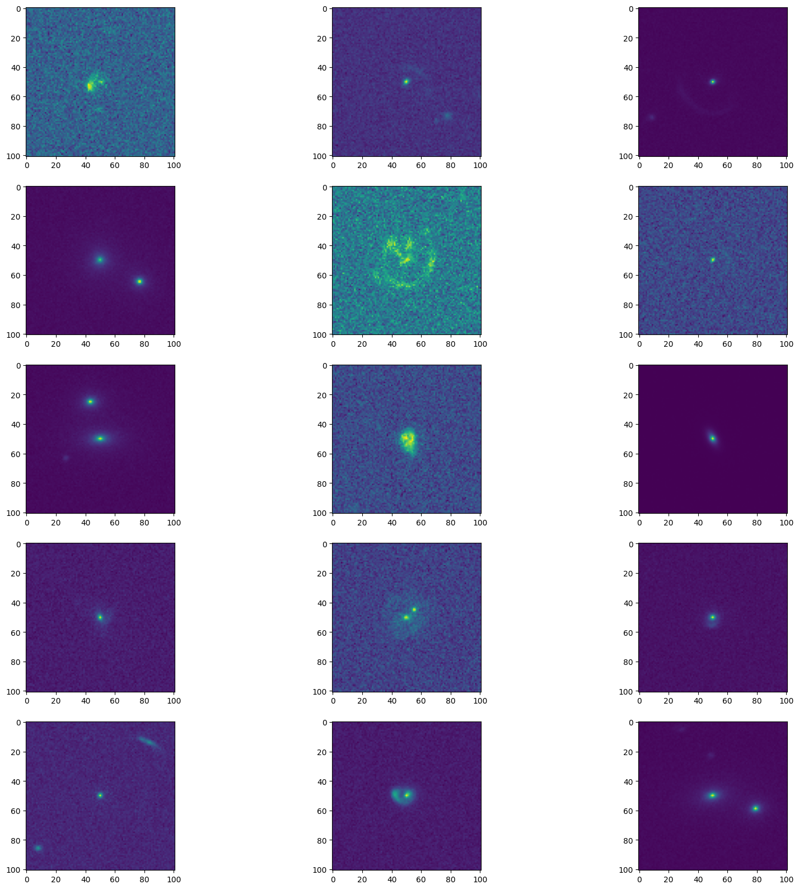
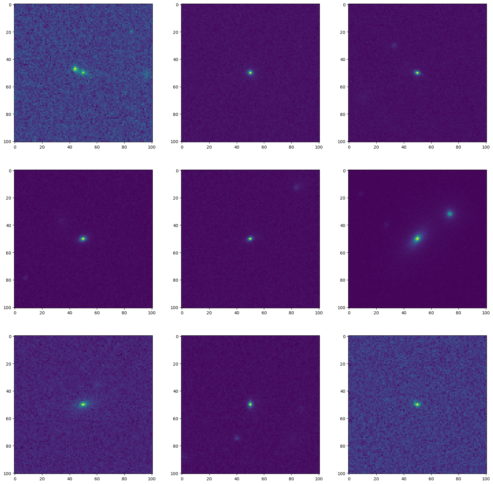
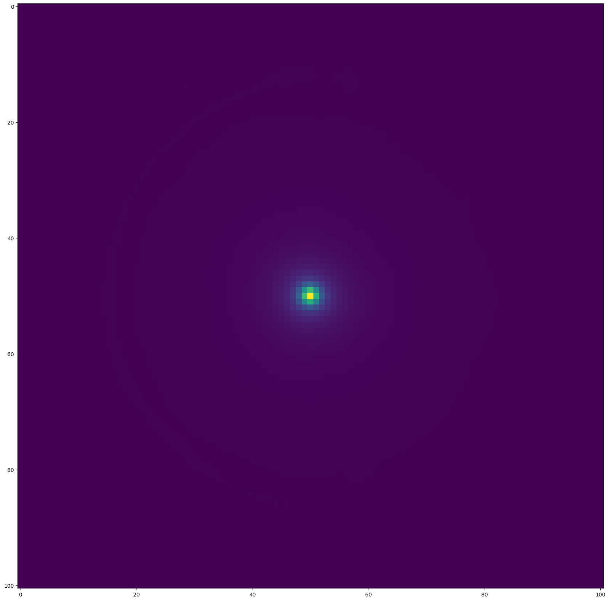
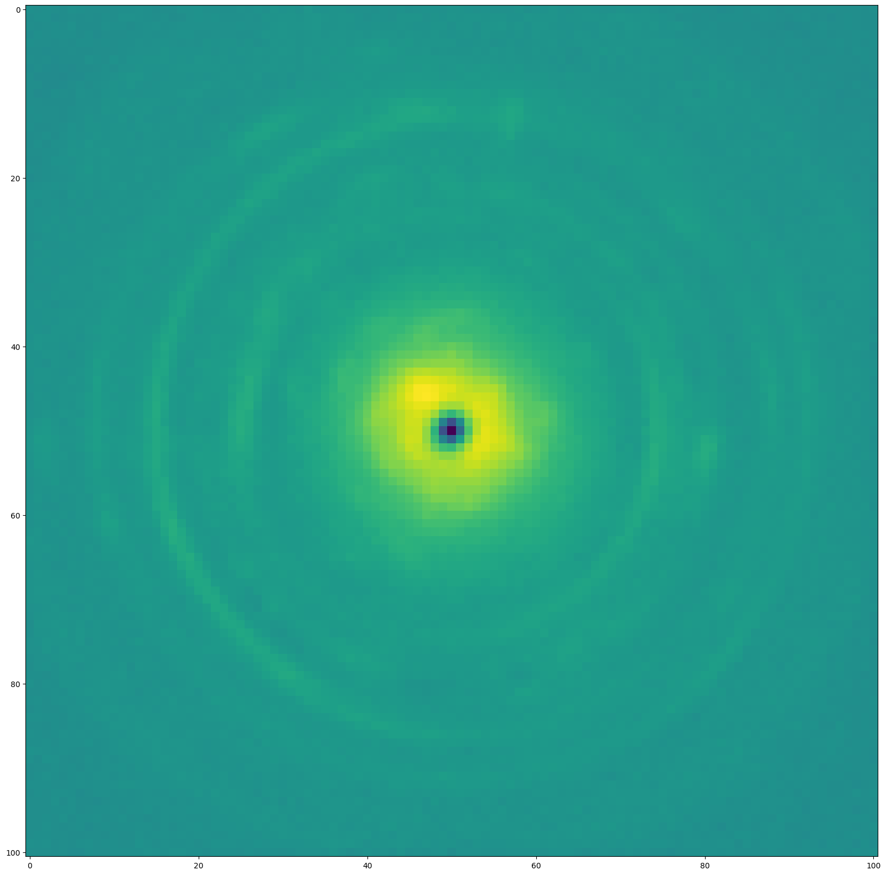
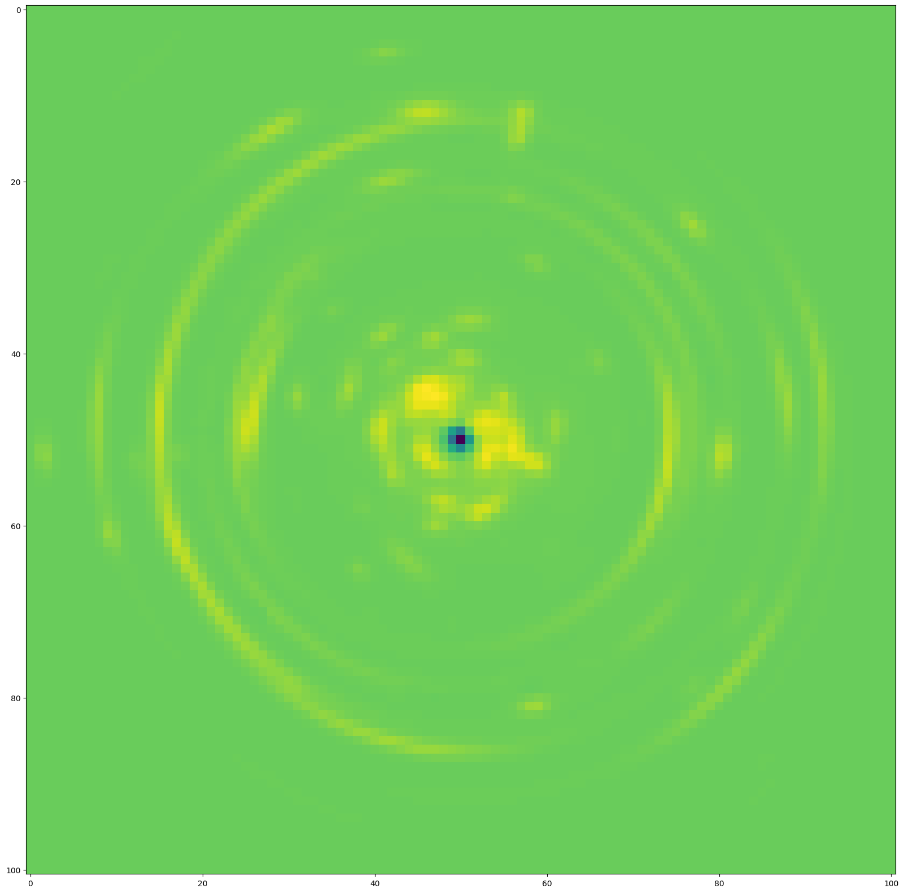
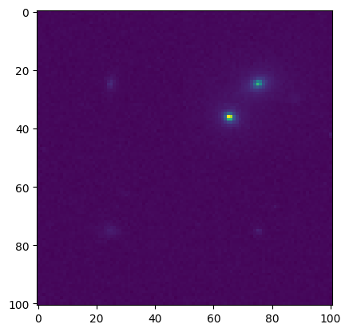
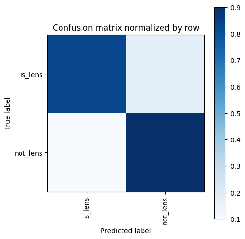
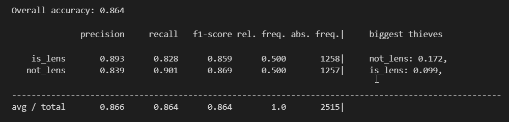
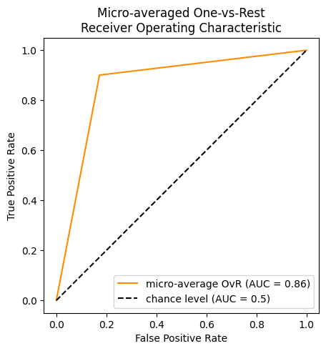

# Test 2

## EDA

### Containes Lens

### Don't containes Lens

## Data Augmentation.

* After meddling with the images a decision was taken to normalize the images.
* For this the overall mean and standard deviation of the images was calculated
* Further the mean and standard deviation of positive and negative images was separately calculated.

### Mean images visualized.

### Difference between the mean images and the standard images  with lense vs without lense

* Mean Image

* Standard Deviation Image

## Data Generation.

* There are 12k images that have lens and 5k images without lens.
* To fill the 7k images, images were generated by combining randomly 4 images that doesn't have lens and resized them.
* After this classes were balanced.

## Results

* SSL => Self Supervised Learning.
* AE => Auto Encoder. 

| Method             | Description | Augmentation on data |Result (Accuracy) |
|--------------------|-------------|--|-----------------|
|Basic CNN           | custom CNN network with no pretrain weights| None | Not Converging |
|Resnet18| Resnet pretrained on Imagenet| Data Generation | Not Converging |
|AE| custom AE to use SSL | Data Generation | Output is Not Good enough |
|MobileViT | Visual Attention Transformer pretrained on Imagenet | Data Generation and Normalization |0.864 |

### Best Results

